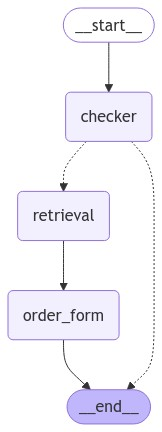

# Python examples

## Pizza Bot (`pizzabot.py`)

A simple chatbot that runs a straightforward conversation for pizza ordering.

The Pizza Bot's dialogue graph is presented below:

### How to run

1. Run `python pizzabot.py` within the `python_examples/`
2. Follow the dialogue in your console

## External Tools

Pizza API: https://demos.swe.htwk-leipzig.de/pizza-api/docs

## Requirements

Make sure you have:
* Python 3.9 or higher
* Installed the libs from `requirements.txt`
